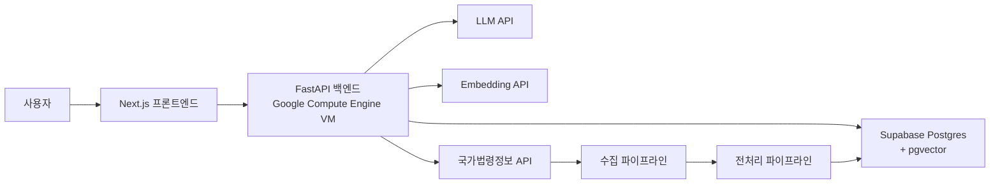
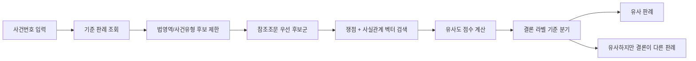

# 개발 계획서
## 유사 판례 및 반대 결론 판례 탐색 서비스

| 항목 | 내용 |
| :--- | :--- |
| 기준 문서 | `prd.md` |
| 작성일 | 2026-05-18 |
| 개발 단계 | MVP |
| 문서 목적 | MVP 구현 기준을 정리하고, 이후 유지보수와 확장이 쉬운 구조로 시스템을 설계한다 |

---

## 1. 개발 목표

본 프로젝트의 MVP는 사용자가 입력한 판례와 유사한 판례를 찾고, 그중 유사하지만 결론이 다른 판례를 별도로 제시하는 웹 서비스를 구현하는 것을 목표로 한다.

2026-05-19 현재 첫 구현은 사용자 피드백 검증을 위해 **자연어 사건 설명 입력 → 기준 판례와 반대 결론 판례 즉시 비교** 흐름으로 진행한다. 검색 결과 목록은 초기 화면에서 제거하고, 후보 검색 로직은 내부 파이프라인으로 둔다.

초기 개발에서는 기능을 무리하게 확장하지 않고, 아래 4가지를 우선 달성한다.

1. 판례 데이터를 안정적으로 수집하고 저장한다.
2. 검색 가능한 구조화 데이터와 임베딩을 생성한다.
3. 기준 판례와 유사한 판례를 검색한다.
4. 유사 판례 중 결론이 다른 판례를 구분해 보여준다.

---

## 2. 설계 원칙

### 2.1 MVP 우선 원칙

- 핵심 검색 경험을 먼저 완성한다.
- 초기 버전에서는 기능 수보다 검색 정확도와 신뢰도를 우선한다.
- 고급 학습 기능, 상세 법률 해설, 개인화 기능은 이후 확장으로 미룬다.

### 2.2 왜곡 최소화 원칙

- 원문 판례와 LLM 가공본을 분리 저장한다.
- 원문 확인 경로를 항상 제공한다.
- LLM은 보조 역할로 한정한다.
- 사용자에게는 "반대 판례"보다 "유사하지만 결론이 다른 판례"라는 표현을 기본으로 사용한다.

### 2.3 유지보수성 원칙

- 기능을 역할별 모듈로 분리한다.
- 사용자 요청 처리와 배치 처리를 분리한다.
- 외부 API 연동 코드는 독립 모듈로 관리한다.
- LLM 프롬프트와 모델 설정은 코드와 분리해 버전 관리한다.
- DB 스키마 변경은 마이그레이션 도구로 관리한다.

---

## 3. 기술 스택

### 3.1 프론트엔드

| 항목 | 기술 |
| :--- | :--- |
| 프레임워크 | Next.js |
| 언어 | TypeScript |
| 스타일링 | Tailwind CSS |
| UI 컴포넌트 | shadcn/ui |
| 아이콘 | lucide-react |
| 애니메이션 | Framer Motion, 필요 시 제한적으로 사용 |

### 3.2 백엔드

| 항목 | 기술 |
| :--- | :--- |
| 프레임워크 | FastAPI |
| 언어 | Python |
| ORM | SQLAlchemy 2.x |
| 마이그레이션 | Alembic |
| 비동기 서버 | Uvicorn |
| 웹 서버 | Nginx |

### 3.3 데이터베이스

| 항목 | 기술 |
| :--- | :--- |
| DB | Supabase Postgres |
| 벡터 검색 | pgvector |
| 연결 방식 | SQLAlchemy 기반 직접 연결 |

### 3.4 배치 및 인프라

| 항목 | 기술 |
| :--- | :--- |
| 배치 처리 | Python |
| 스케줄링 | APScheduler |
| 컨테이너 | Docker |
| 백엔드 배포 | Google Compute Engine VM |
| 고정 주소 | Static External IP |

### 3.5 AI 연동

| 항목 | 기술 |
| :--- | :--- |
| 임베딩 | OpenAI Embeddings API |
| LLM | 초기 벤치마크 후 확정 |

---

## 4. 외부 API

### 4.1 국가법령정보 API

#### 사용 목적

- 대법원 판례 원문 수집
- 사건번호, 선고일, 참조조문, 판례 본문 등 원천 데이터 확보

#### 설계상 중요 사항

- 사용을 위해 고정된 URL이 필요하다.
- 따라서 백엔드는 Google Compute Engine VM에 배포하고 고정 외부 IP를 사용한다.
- 호출 제한을 고려해 rate limit, exponential backoff, 체크포인트 저장을 구현한다.

### 4.2 임베딩 API

#### 사용 목적

- 사실관계 요약 임베딩 생성
- 핵심 쟁점 요약 임베딩 생성
- 자연어 검색어 임베딩 생성

#### 초기 후보

- `text-embedding-3-small`

### 4.3 LLM API

#### 사용 목적

- 핵심 쟁점 추출
- 사실관계 요약
- 판결 결과 라벨링
- 선택 판례 간 짧은 비교 설명 생성

#### 초기 운영 방침

- 특정 모델은 즉시 고정하지 않는다.
- 샘플 판례 세트로 벤치마크 후 확정한다.
- 평가 항목은 다음과 같다.
  - 판결 결과 라벨 정확도
  - 요약 왜곡 정도
  - JSON 구조화 응답 안정성
  - 한국어 법률 문장 처리 품질
  - 비용

---

## 5. 전체 시스템 아키텍처



---

## 6. 모듈 분리 전략

유지보수성과 확장성을 위해 시스템을 아래 모듈로 분리한다.

| 모듈 | 책임 |
| :--- | :--- |
| `frontend` | 검색 화면, 결과 목록, 비교 화면 |
| `api` | 사용자 요청 처리, 응답 조립 |
| `collector` | 국가법령정보 API 수집 |
| `preprocessor` | 원문 정규화, 필드 추출 |
| `llm_service` | LLM 호출, 프롬프트 버전 관리 |
| `embedding_service` | 임베딩 생성 |
| `search_engine` | 후보군 조회, 유사도 계산, 결과 분기 |
| `database` | ORM 모델, repository, migration |
| `scheduler` | 월간 수집 및 재처리 작업 |
| `admin_ops` | 재처리 큐, 검수 상태, 오류 신고 관리 |

### 6.1 분리 원칙

- 외부 API 호출 로직은 비즈니스 로직과 분리한다.
- 검색 로직은 FastAPI 라우터 내부에 직접 작성하지 않는다.
- LLM 프롬프트는 별도 파일 또는 설정 디렉터리에서 관리한다.
- DB 접근은 repository 계층을 통해 수행한다.
- 배치 파이프라인은 사용자 API 서버와 독립적으로 실행 가능해야 한다.

---

## 7. 데이터 파이프라인

### 7.1 목적

국가법령정보 API에서 수집한 판례 원문을 검색 가능한 구조화 데이터로 변환해 DB에 저장한다.

### 7.2 처리 흐름


### 7.3 단계별 상세

#### 1. 판례 수집

- 최신 10개년 대법원 판례를 수집한다.
- 중복 판례는 재저장하지 않는다.
- rate limit, 재시도, 체크포인트를 지원한다.

#### 2. 원문 정규화

- HTML/XML 태그 제거
- 공백 및 줄바꿈 정리
- 주요 섹션 분리
  - 주문
  - 판시사항
  - 판결요지
  - 참조조문
  - 참조판례
  - 본문

#### 3. LLM 구조화 추출

- 핵심 쟁점 요약
- 사실관계 요약
- 판결 결과 라벨
- 필요 시 사건 유형 또는 법영역 보조 분류

#### 4. 임베딩 생성

- 사실관계 요약 임베딩
- 쟁점 요약 임베딩

#### 5. DB 적재

- 원문 데이터
- 구조화 데이터
- 임베딩 데이터
- 처리 상태
- 프롬프트 버전
- 모델 정보

#### 6. 품질 검수

- 필수 필드 누락 확인
- 라벨 분포 이상 확인
- 샘플 수동 검수
- 실패 건 재처리 큐 등록

---

## 8. 검색 파이프라인

### 8.1 사건번호 검색 흐름



### 8.2 자연어 검색 흐름


### 8.3 초기 검색 기준

| 기준 | 설명 |
| :--- | :--- |
| 참조조문 일치 | 법적 관련성 우선 확보 |
| 핵심 쟁점 유사도 | 같은 법적 질문인지 판단 |
| 사실관계 유사도 | 사건 맥락 유사성 판단 |
| 판결 결과 라벨 | 같은 결론과 다른 결론 분리 |

### 8.4 결과 분류

- 유사 판례
- 유사하지만 결론이 다른 판례
- 검색 제외 판례

---

## 9. LLM 사용 전략

### 9.1 배치 전처리 단계

LLM은 주로 배치 단계에서 사용한다.

- 핵심 쟁점 추출
- 사실관계 요약
- 판결 결과 라벨링

이 단계에서 생성된 결과는 DB에 저장하고, 검색 시 재사용한다.

### 9.2 실시간 사용자 요청 단계

실시간으로는 제한적으로만 사용한다.

- 선택된 두 판례 간 짧은 비교 설명 생성

### 9.3 LLM 실패 대응

- 출력 파싱 실패 시 재시도
- 일정 횟수 초과 시 실패 상태 저장
- 실패 건은 재처리 큐에 등록
- 비교 설명 생성 실패 시 검색 결과 자체는 유지한다.

---

## 10. 데이터 저장 전략

### 10.1 저장 계층

| 계층 | 저장 내용 |
| :--- | :--- |
| 원문 계층 | 판례 원문, 원문 URL, 기본 메타데이터 |
| 검색 계층 | 쟁점 요약, 사실관계 요약, 참조조문, 판결 결과 라벨 |
| 벡터 계층 | 쟁점 임베딩, 사실관계 임베딩 |
| 운영 계층 | 처리 상태, 검수 여부, 오류 신고 수, 프롬프트 버전 |

### 10.2 설계 원칙

- 원문과 가공 데이터를 분리한다.
- 검색에 필요한 필드만 MVP에 우선 포함한다.
- 이후 기능 확장을 고려해 판례 원문과 메타데이터는 충분히 보존한다.

---

## 11. UI/UX 설계 방향

### 11.1 제품 경험 목표

- 처음 보는 사용자도 어렵지 않게 검색을 시작할 수 있어야 한다.
- 유사 판례와 결론이 다른 판례의 구분이 즉시 보여야 한다.
- 정보량은 많지만 화면은 복잡해 보이지 않아야 한다.
- 신뢰감 있고 세련된 인상을 주어야 한다.

### 11.2 디자인 원칙

- 깔끔하고 절제된 레이아웃
- 명확한 타이포그래피 위계
- 충분한 여백
- 카드와 배지 사용은 정보 구분에만 제한적으로 사용
- 결과 화면은 스캔하기 쉽게 구성
- 모바일에서도 핵심 정보가 먼저 보여야 함

### 11.3 주요 화면

1. 검색 화면
2. 결과 목록 화면
3. 비교 화면

### 11.4 디자인 시스템 권장 방향

- 중립적이되 차갑지 않은 색상
- 판결 결과 라벨은 색상과 텍스트를 함께 사용
- 시각적 장식보다 정보 구조를 우선
- 제품 전체에서 일관된 간격, 버튼, 배지, 폰트 체계 유지

---

## 12. 배포 구조

### 12.1 백엔드

- Google Compute Engine VM
- Static External IP 사용
- Docker 기반 배포
- Nginx reverse proxy
- FastAPI 애플리케이션 실행

### 12.2 프론트엔드

- Vercel 배포를 우선 고려
- 필요 시 별도 정적 호스팅으로 전환 가능

### 12.3 데이터베이스

- Supabase Postgres
- `pgvector` 활성화
- 가능하면 DB 접근 허용 IP를 백엔드 서버로 제한

---

## 13. 실패 처리 및 운영 정책

### 13.1 수집 실패

- 재시도
- 실패 로그 저장
- 다음 배치 재수집 대상 등록

### 13.2 전처리 실패

- 실패 상태 저장
- 재처리 큐 등록

### 13.3 임베딩 실패

- 검색 대상에서 제외
- 재처리 큐 등록

### 13.4 검색 결과 없음

- 사용자에게 검색 범위 확장 안내
- 사건번호 재확인 안내

### 13.5 설명 생성 실패

- 검색 결과는 정상 표시
- 설명만 재시도 가능하게 처리

---

## 14. 개발 단계

### Phase 1. 기반 구축

- 프로젝트 구조 설정
- Supabase 연결
- DB 스키마 설계
- GCE VM 배포 환경 구성
- 국가법령정보 API 연동 준비

### Phase 2. 데이터 파이프라인

- 판례 수집기 구현
- 정규화 로직 구현
- LLM 전처리 연동
- 임베딩 생성
- DB 적재
- 재처리 큐 구현

### Phase 3. 검색 엔진

- 사건번호 검색
- 자연어 검색
- 후보군 필터링
- 벡터 유사도 검색
- 결론 라벨 기준 분기

### Phase 4. 프론트엔드

- 검색 화면
- 결과 목록 화면
- 비교 화면
- 반응형 UI
- 기본 피드백 UI

### Phase 5. 품질 개선

- 검색 품질 점검
- 라벨 정확도 검수
- 디자인 정제
- 에러 처리 보강

---

## 15. 권장 코드 구조

```text
project-root/
  frontend/
    src/
      app/
      components/
      features/
      lib/
      styles/

  backend/
    app/
      api/
      core/
      db/
      models/
      repositories/
      schemas/
      services/
        llm/
        embedding/
        search/
      workers/
      utils/

    pipelines/
      collector/
      preprocessor/
      scheduler/

    migrations/

  docs/
    prd.md
    development_plan.md
    api_spec.md
    db_schema.md
    ui_spec.md
```

### 15.1 구조 설계 이유

- `frontend`와 `backend`를 명확히 분리한다.
- 사용자 요청 처리와 배치 파이프라인을 분리한다.
- `services`에는 외부 시스템 연동과 핵심 비즈니스 로직을 둔다.
- `repositories`는 DB 접근만 담당한다.
- `pipelines`는 수집과 전처리 실행 흐름을 담당한다.
- 문서도 기능별로 분리해 이후 변경 이력을 추적하기 쉽게 한다.

---

## 16. 후속 문서화 계획

본 개발 계획서 이후에는 아래 문서를 순차적으로 작성한다.

1. `api_spec.md`
2. `db_schema.md`
3. `pipeline_spec.md`
4. `ui_spec.md`
5. `deployment_guide.md`

각 문서는 하나의 책임만 갖도록 분리한다.

---

## 17. 최종 개발 방향

본 프로젝트는 `유사 판례 검색`과 `유사하지만 결론이 다른 판례 탐색`이라는 MVP 핵심에 집중한다.  
초기부터 시스템을 역할별로 분리해 설계함으로써, 이후 검색 품질 개선, 학습 기능 추가, 사용자 계정 기능 도입, 하급심 확장 등 후속 개발이 수월하도록 한다.
